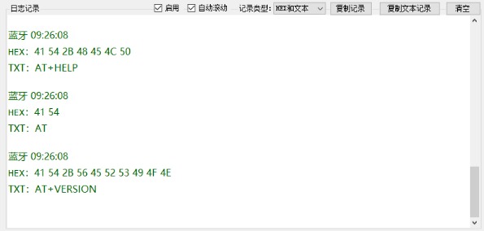

# 串口日志展示控件

经常制作串口类软件

封装组件,方便调用

### 界面预览



### 参数说明

```csharp
//启用记录
bool LogEnable = true;
//是否自动滚动
bool LogAutoScroll=true;
//串口日志类型
LogType SerialLogType;
//串口日志中文字体
string SerialLogChineseFontFamily = "Microsoft YaHei";
//串口日志英文字体
string SerialLogEnglishFontFamily = "Consolas";

 /// <summary>
/// 日志类型
/// </summary>
public enum LogType
{
    /// <summary>
    /// HEX和文本
    /// </summary>
    HEX_And_TEXT,
    /// <summary>
    /// 仅显示HEX
    /// </summary>
    HEX,
    /// <summary>
    /// 仅显示文本数据
    /// </summary>
    TEXT
}
```